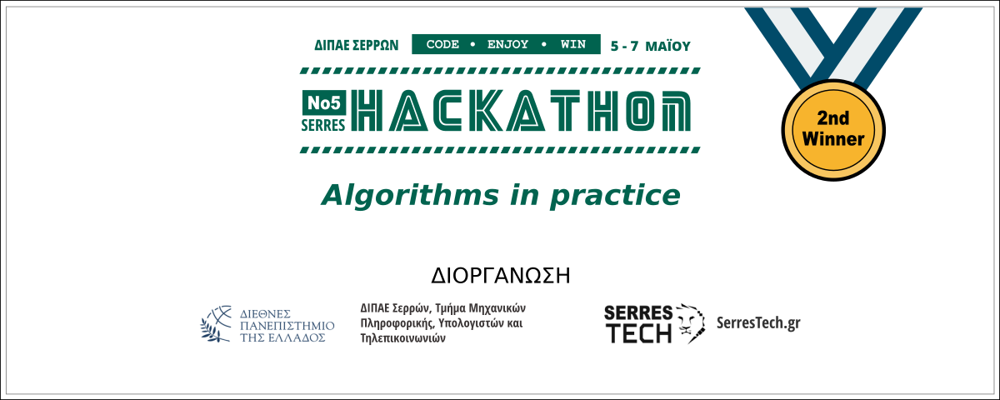

# Open Source UoM Serres Hackathon 2023

Hackathon topic 2023: https://github.com/serrestech/hackathon-topic

The "Tile Factory 1981" Problem Solver is a Python program that solves the "pentomino" problem.
This problem is a classic optimization problem that involves finding the optimal way to produce tiles of different sizes using a limited set of machines.

[](https://hackathon.serrestech.gr)

## Table of Contents

- [Open Source UoM Serres Hackathon 2023](#open-source-uom-serres-hackathon-2023)
  - [Table of Contents](#table-of-contents)
  - [Background](#background)
  - [Installation](#installation)
  - [Usage](#usage)
  - [Contributors](#contributors)
  - [License](#license)

## Background

Suppose you work for a large factory making decorative ceramic wall tiles back in 1981!

You are member of the R&D team and you supervisors ask your team to find a way help the factory solve several problems.

The most urgent problem comes from an old cutting machine which produces many tile scraps with a "strange shape".

Your team have to find an innovative way to sell these strange tiles so the company doesn't have to throw them away or recycle them back.

Your team has only 42 hours to solve all the tasks is asked for! If you solve all the tasks you get 350pts and win a salary increase!

## Installation

To install the Tile Factory 1981 Problem Solver, simply clone the repository and install the required dependencies:

```shell
git clone git@github.com:Open-Source-UoM/serres-hackathon-uom.git
cd serres-hackathon-uom
npm install
npm run dev
```

## Usage

To use the Tile Factory 1981 Problem Solver, simply use the Graphical User Interface(GUI) that will lunch on local host with the previous commands.

1.Select number of rows, columns and pixels(grid/array)
2.Select holes(black) if any.
3.Choose letters(can choose rotated letters)
4.Option to save current configuration
5.Option to load saved configuration
6.Solve the problem
7.Option to download results.

## Contributors

@GeorgeApos
@nGeorgit
@anEleftheriadis
@GeorgeFkd

## License

Distributed under the [MIT License](LICENSE).
